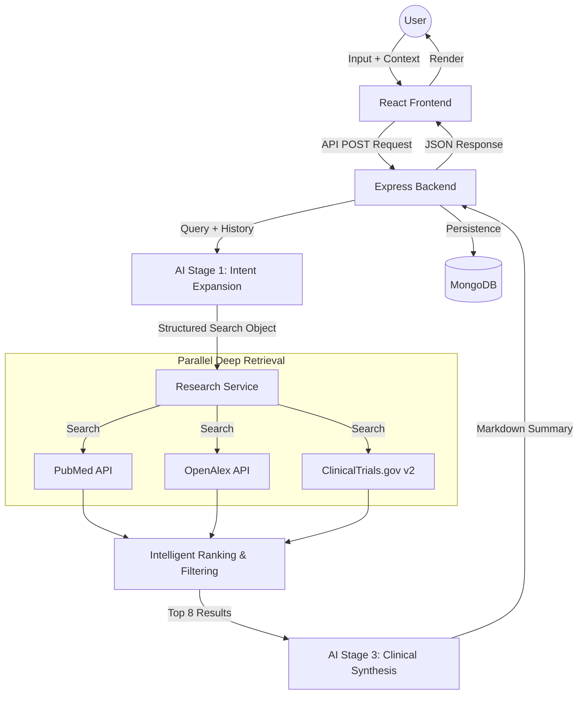

# 🧬 CuraLink AI: End-to-End Architecture & Workflow

This document provides a comprehensive technical walkthrough of how CuraLink AI processes a request, from user input to final research synthesis.

---

## 🏗️ High-Level System Architecture



---

## 🛠️ Step-by-Step Breakdown

### 1. User Input & Context Aggregation
The frontend captures two types of data:
- **Direct Query**: "Are there new treatments for Alzheimer's?"
- **Medical Context**: Disease (Alzheimer's), Location, Intent (Research).
- **Session State**: The `sessionId` is retrieved from `localStorage` to maintain multi-turn context.

### 2. Stage 1: Intelligent Query Expansion (LLM)
Natural language is often too imprecise for clinical databases. We pass the query to **Groq (Llama 3.1 8B)**.

**The Prompt:**
> "You are a medical search intent analyzer. Your goal is to convert a user's natural language query and patient context into a structured search object. Analyze the query and history to extract searchTerm, condition, intervention, status, and year filters."

**Example Transformation:**
- *From:* "What is the recent work for stage 3 lung cancer?"
- *To:* `{ "searchTerm": "lung cancer stage 3 immunotherapy", "filters": { "condition": "Lung Cancer", "yearStart": 2020 } }`

---

### 3. Stage 2: Deep Evidence Retrieval (The Lattice)
Using the structured search object, the system triggers three concurrent API streams:

| Stream | Methodology |
| :--- | :--- |
| **PubMed** | 1. Hits `esearch.fcgi` for paper IDs. <br> 2. Hits `efetch.fcgi` for full XML article metadata. |
| **OpenAlex** | Queries the global work graph with `relevance_score:desc` and date filters. |
| **ClinicalTrials** | Uses `query.cond` and `filter.overallStatus` for human trials specifically. |

**Depth Calculation:** The system retrieves up to **200 candidate results** per source to ensure no "rare" but highly relevant research is overlooked.

---

### 4. Intelligent Ranking System
Before synthesis, every item is scored to prioritize quality:
- **Condition Match (+40 pts)**: Title/Abstract contains the primary disease.
- **Intervention Match (+30 pts)**: Matches specific drugs/treatments provided in context.
- **Recency Boost (+5 pts)**: Published in the last 3 years.
- **Source Weight (+3 pts)**: Bonus for PubMed (NCBI) peer-reviewed content.

*The top 8 highest-scoring papers and trials are passed to the final reasoning engine.*

---

### 5. Stage 3: Clinical Synthesis & Feedback Loop (LLM)
We feed the top results, original question, and conversation history into **Groq (Llama 3.3 70B)**.

**The Logic:**
- **Condition Overview**: AI explains the current state of the disease.
- **Research Insights**: AI scans the abstracts of the top 8 papers to find trends.
- **Clinical Trials**: AI translates NCT protocol language into readable eligibility criteria.
- **Strict Attribution**: Every insight is cross-referenced using the `[Title | Authors | URL]` format.

---

### 6. Multi-Turn Persistence (MongoDB)
Every research session is stored in MongoDB:
```json
{
  "sessionId": "abc-123",
  "messages": [
    { "role": "user", "text": "...", "timestamp": "..." },
    { "role": "assistant", "text": "...", "results": { "publications": [...], "trials": [...] } }
  ]
}
```
This allows the user to ask, *"Are there side effects?"* in the next turn. The backend will inject the previous turn's "Lung Cancer" context into the next retrieval cycle.

---

### 7. Global Deployment (Render)
- **Backend**: Hosted on Render with auto-redeploy enabled via GitHub Hooks.
- **Frontend**: Vite-built production assets served via the Node backend.
- **Connectivity**: Managed via `API_BASE` environment variables ensuring secure communication between frontend and backend.
